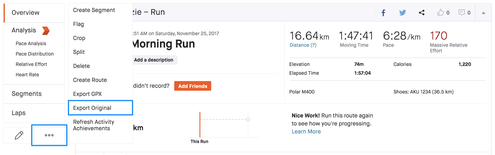

# Starva - .fit Activity Visualizer

[](https://opensource.org/licenses/MIT)
[](https://en.cppreference.com/w/cpp/20)

**Starva** is a high-performance C++ tool designed to transform your Garmin or Strava `.fit` activity files into interactive HTML maps. Starva allows you to visually analyze your performance by highlighting specific training metrics like **speed**, **heart rate**, or **power** using dynamic, smooth color gradients.


---

## Features

- **Interactive Maps**: Generates self-contained HTML files powered by [MapLibre GL JS](https://maplibre.org/).
- **Metric-Driven Gradients**:
  - **Speed**: Visualize where you were pushing the pace.
  - **Heart Rate**: Identify your effort zones at a glance.
  - **Power**: Analyze your output distribution (for power-meter-equipped rides).
- **Fast & Efficient**: Built on top of the official Garmin FIT SDK for reliable and speedy parsing.


---

## Getting Started

### Prerequisites

- **CMake** (3.11 or higher)
- **C++20 Compiler** (GCC 10+, Clang 10+, or MSVC 2019+)

### Installation

1. Clone the repository:
   ```bash
   git clone https://github.com/mrkosmi/starva.git
   cd starva
   ```

2. Build the project:
   ```bash
   mkdir build && cd build
   cmake ..
   cmake --build .
   ```

The executable `starva_app` will be located in the `build` directory.

---

## Usage

Run the application by providing the path to your `.fit` file:

```bash
./starva_app <path_to_fit_file> [options]
```

### Options

| Flag | Name | Description | Default |
| :--- | :--- | :--- | :--- |
| `-m, --mode` | Mode | Choose metric for color mapping: `speed`, `power`, `heartrate`, `none`. | `none` |
| `-o, --output`| Output | Path to the generated HTML file. | `activity.html` |
| `-s, --show` | Show | Automatically open the generated map in your default browser. | `false` |

### Examples

**Visualize speed for a morning run:**
```bash
./starva_app examples/10k-run.fit --mode speed --show
```

**Analyze heart rate zones for a long ride:**
```bash
./starva_app examples/80k-ride.fit -m heartrate -o ride_analysis.html
```

---

### How to export a [Strava](Strava.com) activity

Navigate to one of your Activity pages and from the more (ellipses) menu, select "Export Original".



---

## Project Structure

- `src/` & `include/`: Core application logic (Parser, Generator, Activity management).
- `vendor/`: Third-party dependencies (FIT SDK, CLI11, nlohmann/json).
- `examples/`: Sample `.fit` files for testing.

---

## License

This project is licensed under the MIT License - see the [LICENSE](LICENSE) file for details.

---

## Acknowledgments

- [Garmin FIT SDK](https://developer.garmin.com/fit/overview/)
- [MapLibre GL JS](https://maplibre.org/)
- [CLI11](https://github.com/CLIUtils/CLI11)
- [nlohmann/json](https://github.com/nlohmann/json)

---

Developed by [mrkosmi](https://github.com/mrkosmi)
